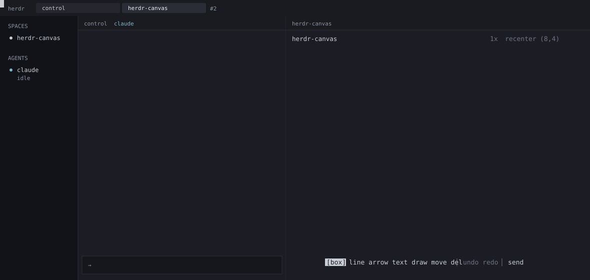

<h3 align="center">
  herdr-canvas
</h3>

<p align="center">herdr-canvas makes ASCII diagrams in the terminal. A herdr agent can read the diagrams and change the diagrams.</p>

<p align="center">
  
</p>

<p align="center">
  <a href="#install">Install</a> · <a href="#use">Use</a> · <a href="#herdr-agents">herdr agents</a>
</p>

---

herdr-canvas is a herdr plugin. herdr-canvas is also a binary. There is one JSON file for each diagram. herdr-canvas makes the picture from the JSON file.

The element types are `box`, `line`, `text`, and `draw`. Each element has an identifier (`b1`, `l2`, `t3`, `f4`). herdr-canvas does not use an identifier again.

## Install

herdr-canvas operates on Linux and on macOS. If you use Windows, use **WSL2** and a `Linux_*` archive.

herdr 0.8.2 or a subsequent version is necessary. git is necessary. curl or wget is necessary. Go is not necessary.

```bash
herdr plugin install aorumbayev/herdr-canvas
```

Or put `herdr-canvas` from [Releases](https://github.com/aorumbayev/herdr-canvas/releases) on `PATH`.

The `setup` command writes `prefix+d` one time to `~/.config/herdr/config.toml`. If you uninstall the plugin, that command does not remove `prefix+d`. herdr uses `prefix+c` for a new tab.

The `herdr-canvas update` command installs a subsequent tag from GitHub. If herdr installed the herdr-canvas plugin, use `herdr plugin install`. If the version is `dev`, herdr-canvas does not install an update. If the TUI shows that there is a new version, push `i`. The TUI then does not show that indication. The `i` key does not install the update.

## Use

Push `prefix+d` to open the canvas or to close the canvas. If you are in a git repository, herdr-canvas opens the diagram for that repository and that branch. If you are not in a git repository, select a name or make a name.

| Key | Step |
| --- | --- |
| `1`–`6` | Select the tool: select, box, line, arrow, text, or draw. |
| drag | Make a shape. If the tool is select, select a rectangle or move the selection. |
| click | Select one item. If you push shift and click, add the item or remove the item. |
| double-click | Change the text. |
| shift+enter | Start a new line of text. Push enter to record the text. |
| wheel / middle-drag | Move the view. If you push shift, move the view to the side. |
| arrows · space/enter | Move the cursor. Push space or enter to attach the shape. Then record the shape. |
| `c` / `f` | Open the color list. Set the `fill` of a box. |
| `s` | Send the diagram to the herdr agent. |
| `o` | Open the diagram list. |
| `?` / `h` | Show the controls. |
| delete/backspace | Erase the selection (one undo step). |
| `esc` | Cancel the action. Then select the select tool. Then remove the selection. |
| `q` | Stop herdr-canvas. |

herdr-canvas keeps each change immediately. Push Recenter to put the diagram in the view. If you erase a diagram in the list, herdr-canvas tells you to push `y` or `N`. You cannot cancel that erase.

## herdr agents

Push `s`. herdr-canvas writes `export` and `skill` to the input of the herdr agent. herdr-canvas does not send the input. If there is more than one herdr agent, select a herdr agent from the list.

The diagrams are in `~/.local/share/herdr-canvas/`.

```bash
herdr-canvas list
herdr-canvas --name mydiagram export
herdr-canvas --name mydiagram box 2 1 20 6 "web server"
herdr-canvas --name mydiagram line 20 3 34 3 --arrow end
herdr-canvas --name mydiagram delete b1
herdr-canvas skill
```

The `--name` alternative selects a diagram. The `--create` alternative makes a diagram that is missing. If you do not set `--name`, the name is the name of the git repository.

| Command | Function |
| --- | --- |
| `herdr-canvas` | Opens the TUI |
| `new` / `open` / `list` | Makes a diagram, opens a diagram, or shows the names of the diagrams |
| `export` | Shows the picture and the legend |
| `box` `line` `text` `draw` | Adds an element (`--color`, box `--fill`) |
| `move` `delete` `label` `color` `fill` | Changes an element |
| `skill` / `setup` / `update` / `--version` | Shows the instructions, writes the hotkey, installs a tag, or shows the version |

## Tests

```sh
make setup
go test ./...
```

The commit-message hook and the CI reject AI attribution trailers. Releases use Conventional Commits. A `feat` commit increases the minor version. A `fix` commit increases the patch version. The major version stays at 0. To start a release, use `workflow_dispatch` on the `release` workflow. A release tag on GitHub stays as it is after the release is complete.

## License

MIT
